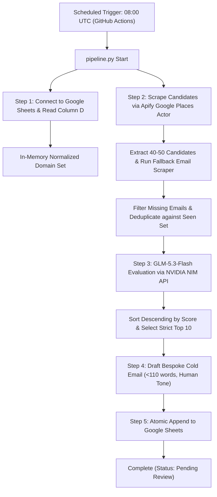

# Autonomous Daily Lead Prospector & Cold Outreach Pipeline (NVIDIA NIM Edition)

An autonomous, production-grade B2B lead generation and cold outreach pipeline powered by **GLM-5.3-Flash** (`z-ai/glm-5.3-flash`) via the **NVIDIA NIM API**, **Apify**, and **Google Sheets**.

Every morning at **08:00 UTC**, the pipeline:
1. **Deduplicates**: Reads historical records from Google Sheets (Column D - `Website URL`) to prevent duplicate outreach across past runs.
2. **Scrapes**: Discovers 40–50 high-ticket B2B service firms daily across rotating global markets (US, UK, AU, CA, EU) with fallback email extraction.
3. **Evaluates & Scores**: Uses `z-ai/glm-5.3-flash` on NVIDIA NIM to audit digital positioning, assigning a 1–100 quality score and classifying each prospect into `"Authority Website"` or `"AI Growth Website"`.
4. **Drafts Pitches**: Selects strictly the **top 10** highest-scoring leads and writes personalized, human-like cold emails (<110 words) free of AI cliches.
5. **Syncs to Sheets**: Appends all 10 curated leads and pitches to Google Sheets (`Outreach Pipeline - Daily Top 10`) under `Status = "Pending Review"`.

---

## Architecture & Data Flow



---

## 11-Column Google Sheet Schema

Records are appended to the worksheet tab `Outreach Pipeline - Daily Top 10` (auto-created if not present):

| Column # | Column Header | Description |
| :---: | :--- | :--- |
| **A** | `Date Added` | Date in `YYYY-MM-DD` format |
| **B** | `Company Name` | Business name |
| **C** | `Country/Region` | Country code (US, UK, AU, CA, EU) |
| **D** | `Website URL` | **Primary Deduplication Key** (Normalized in memory) |
| **E** | `Contact Email` | Verified business contact email |
| **F** | `Offer Angle` | `"Authority Website"` or `"AI Growth Website"` |
| **G** | `Quality Score` | 1–100 score based on deal size and modernization urgency |
| **H** | `Core Pain Point` | Concise 1-sentence digital bottleneck |
| **I** | `Subject Line` | 3–6 word curiosity-driven subject line |
| **J** | `Custom Email Pitch` | Peer-to-peer technical cold email pitch (<110 words) |
| **K** | `Status` | Initial status: `"Pending Review"` |

---

## Setup & Prerequisites

### 1. NVIDIA NIM API Access (`z-ai/glm-5.3-flash`)
1. Visit **[build.nvidia.com](https://build.nvidia.com/)**.
2. Sign in with your NVIDIA account and search for **`z-ai/glm-5.3-flash`**.
3. Click **Get API Key** to generate your `nvapi-...` key.
4. NVIDIA NIM provides an OpenAI-compatible endpoint at `https://integrate.api.nvidia.com/v1`.

### 2. Google Cloud Service Account & Google Sheet
1. Open the [Google Cloud Console](https://console.cloud.google.com/).
2. Create a new project (e.g. `lead-pipeline-automation`).
3. Enable both the **Google Sheets API** and **Google Drive API** in APIs & Services.
4. Navigate to **IAM & Admin > Service Accounts**, create a service account, and generate a **JSON key**. Download this file.
5. Create a new Google Sheet (or open an existing one).
6. Note the Spreadsheet ID from the URL:
   ```
   https://docs.google.com/spreadsheets/d/<GOOGLE_SHEET_ID>/edit
   ```
7. Click **Share** on your Google Sheet and add the service account's `client_email` with **Editor** permissions.

### 3. Apify API Token
1. Sign up at [apify.com](https://apify.com/).
2. Go to **Settings > Integrations > API Tokens** and copy your token.
3. The scraper uses the actor `compass/crawler-google-places` to extract B2B listings with root domain websites.

---

## Local Development & Testing

### Installation
```bash
# Clone the repository
git clone https://github.com/ankurnit112-coder/lead.git
cd lead

# Install dependencies
pip install -r requirements.txt
```

### Dry-Run & Offline Verification (No API Keys Required)
Run the complete pipeline locally using mock data and simulated Google Sheets synchronization:
```bash
python pipeline.py --mock --dry-run
```

### Run Automated Unit & Integration Tests
```bash
python -m pytest tests/ -v
```

### Live Local Execution
Set your environment variables and execute:

**PowerShell:**
```powershell
$env:APIFY_TOKEN = "apify_api_..."
$env:NVIDIA_API_KEY = "nvapi-..."
$env:GOOGLE_SERVICE_ACCOUNT_JSON = Get-Content -Raw "path/to/service-account.json"
$env:GOOGLE_SHEET_ID = "1a2b3c4d..."
python pipeline.py
```

**Bash:**
```bash
export APIFY_TOKEN="apify_api_..."
export NVIDIA_API_KEY="nvapi-..."
export GOOGLE_SERVICE_ACCOUNT_JSON=$(cat path/to/service-account.json)
export GOOGLE_SHEET_ID="1a2b3c4d..."
python pipeline.py
```

---

## GitHub Actions Automated Deployment

The repository includes a production workflow configured at `.github/workflows/daily_pipeline.yml`.

### Configure GitHub Secrets
In your GitHub repository, navigate to **Settings > Secrets and variables > Actions** and add the following repository secrets:

| Secret Name | Required | Description |
| :--- | :---: | :--- |
| `NVIDIA_API_KEY` | **Yes** | NVIDIA NIM API key (`nvapi-...`) from build.nvidia.com |
| `APIFY_TOKEN` | **Yes** | Apify API token |
| `GOOGLE_SERVICE_ACCOUNT_JSON` | **Yes** | Complete raw JSON content of your Google Cloud Service Account key |
| `GOOGLE_SHEET_ID` | **Yes** | Target Google Sheet ID from URL |
| `GOOGLE_WORKSHEET_NAME` | No | Target worksheet tab (default: `Outreach Pipeline - Daily Top 10`) |
| `NVIDIA_MODEL` | No | Model override (default: `z-ai/glm-5.3-flash`) |

### Triggering the Workflow
- **Automatic**: Runs daily at `08:00 UTC` (`0 8 * * *`).
- **Manual**: Navigate to **Actions > Daily Lead Prospector & Cold Outreach Pipeline > Run workflow**. You can pass parameters such as `dry_run=true` or test with `mock_scrape=true`.

---

## Environment Variables Reference

| Variable | Default | Description |
| :--- | :--- | :--- |
| `NVIDIA_API_KEY` | `None` | NVIDIA NIM API key (`nvapi-...`) |
| `NVIDIA_MODEL` | `z-ai/glm-5.3-flash` | NVIDIA NIM model identifier |
| `APIFY_TOKEN` | `None` | Apify API access token |
| `GOOGLE_SERVICE_ACCOUNT_JSON` | `None` | Service account JSON string or file path |
| `GOOGLE_SHEET_ID` | `None` | Google Spreadsheet ID (from URL) |
| `GOOGLE_SHEET_NAME` | `None` | Alternative lookup by spreadsheet name |
| `GOOGLE_WORKSHEET_NAME` | `Outreach Pipeline - Daily Top 10` | Specific tab name within spreadsheet |
| `MAX_CANDIDATES` | `50` | Maximum candidate businesses to scrape per run |
| `DRY_RUN` | `false` | When `true`, logs tabular output without modifying Google Sheets |
| `MOCK_SCRAPE` | `false` | When `true`, uses mock scraper and offline deterministic scoring |
| `NICHE_OVERRIDE` | `None` | Overrides daily rotating niche |
| `REGION_OVERRIDE` | `None` | Overrides daily rotating target region |

---

## License
MIT License.
